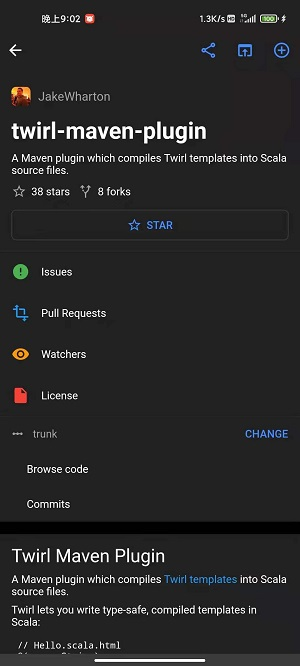

# flutter_github_app
### 一个基于[BLOC](https://www.didierboelens.com/2018/08/reactive-programming-streams-bloc/)设计模式的flutter版本的github客户端，整体UI风格参考官方版本的github客户端，适合想要入门学习flutter的伙伴，欢迎大家start、fork。

## Features
- [x] 使用flutter_bloc实现BLOC
- [x] 基于Device Flow的登陆方式
- [x] 支持语言、主题的切换
- [x] 实现了搜索、通知、个人、仓库等基本功能
- [x] ...

## Tips
- 本人能力有限，如果遇到问题，欢迎[issue](https://github.com/rain9155/flutter_github_app/issues)
- 项目中所使用的api均由github [REST API](https://docs.github.com/en/rest)提供

## Preview

## ScreenShots

