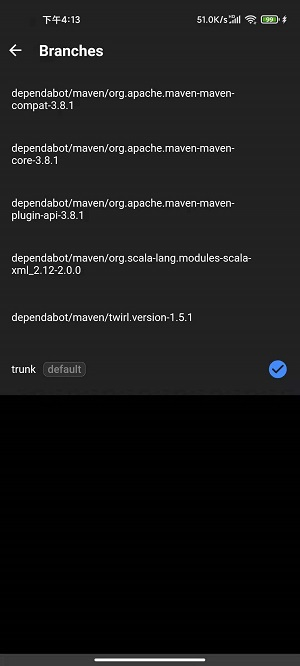

# flutter_github_app
### 一个基于[BLOC](https://www.didierboelens.com/2018/08/reactive-programming-streams-bloc/)设计模式的flutter版本的github客户端，整体UI风格参考官方版本的github客户端，适合想要入门学习flutter的伙伴，欢迎大家start、fork。

## Features
- [x] 使用flutter_bloc实现BLOC
- [x] 基于Device Flow的登陆方式
- [x] 支持语言、主题的切换
- [x] 实现了搜索、通知、个人、仓库等基本功能
- [x] ...

## Tips
- 项目中所使用的api均由github [REST API](https://docs.github.com/en/rest)提供，使用github api需要用到client id，它是你在你的github账号上注册[OAuth App](https://github.com/settings/applications/new)后提供给你的，目前的client id是用我自己的账号注册生成，如果你有其他商业用途例如独立发布Github应用，请自己单独注册，然后把`lib/configs/env.dart`文件中的`CLIENT_ID`的值替换成你注册生成的client id，本项目只供学习使用，不作其他用途

- 本人能力有限，如果遇到问题，欢迎[issue](https://github.com/rain9155/flutter_github_app/issues)

## Preview


## ScreenShots





## Download
android：[点击下载apk](https://github.com/rain9155/flutter_github_app/releases/download/1.0.0/app-release.apk)

ios：由于没有mac和ios开发者账号，无法提供ios包，如果你是ios开发者，可自行clone项目参考[Guide](https://flutter.dev/docs/deployment/ios)进行打包

## Libraries
[flutter_bloc](https://pub.dev/packages/flutter_bloc) - 基于BLOC设计模式来进行状态管理的库

[dio](https://pub.dev/packages/dio) - 支持拦截器，全局配置，FormData，请求取消，文件下载，超时等功能的dart http客户端

[json_serializable](https://github.com/google/json_serializable.dart) - 包含json_serializable、json_anation、build_runner，用于在dart构建系统中自动化生成json序列化和反序列的模板代码

[shared_preferences](https://pub.dev/packages/shared_preferences) - 在特定平台持久化存储键值对的flutter插件，例如iOS和macOS上为NSUserDefaults，Android上为SharedPreferences

[url_launcher](https://pub.dev/packages/url_launcher) - 在特定平台启动url的flutter插件

[fluttertoast](https://pub.dev/packages/fluttertoast) - 在特定平台弹出toast的flutter插件

[webview_flutter](https://pub.dev/packages/webview_flutter) - 在特定平台打开webview的flutter插件

[flutter_html](https://pub.dev/packages/flutter_html) - 用于渲染HTML和CSS标签的flutter控件

[flutter_markdown](https://pub.dev/packages/flutter_markdown) - 用于渲染markdown的flutter控件

[package_info](https://pub.dev/packages/package_info) - 在特定平台查询package信息的flutter插件

[share](https://pub.dev/packages/share) - 在特定平台通过分享对话框分享内容的flutter插件

[sqflite](https://pub.dev/packages/sqflite) - 在特定平台使用SQLite的flutter插件

## TODO
- [ ] 性能优化
- [ ] issue、pullrequest、commit详情页控件化

## Licensed
```
   Copyright 2021 rain9155

   Licensed under the Apache License, Version 2.0 (the "License");
   you may not use this file except in compliance with the License.
   You may obtain a copy of the License at

       http://www.apache.org/licenses/LICENSE-2.0

   Unless required by applicable law or agreed to in writing, software
   distributed under the License is distributed on an "AS IS" BASIS,
   WITHOUT WARRANTIES OR CONDITIONS OF ANY KIND, either express or implied.
   See the License for the specific language governing permissions and
   limitations under the License.
```
